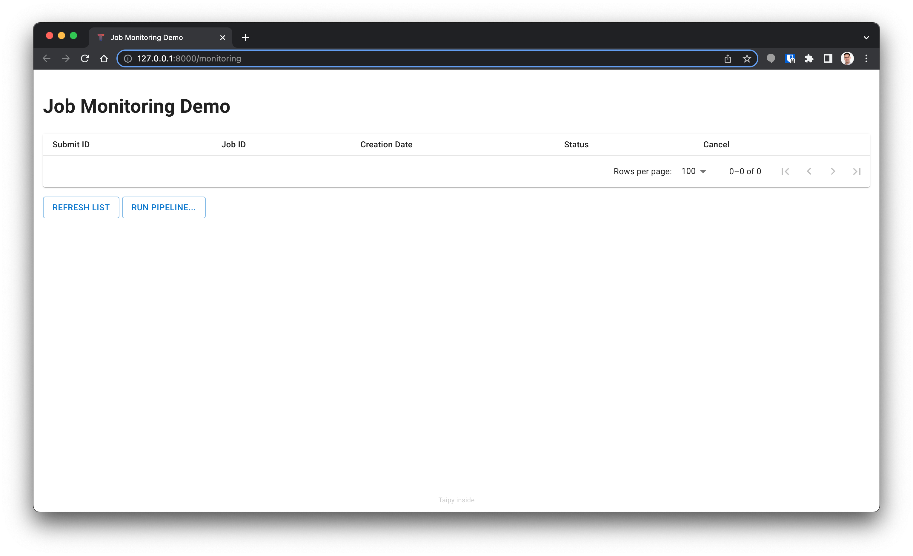
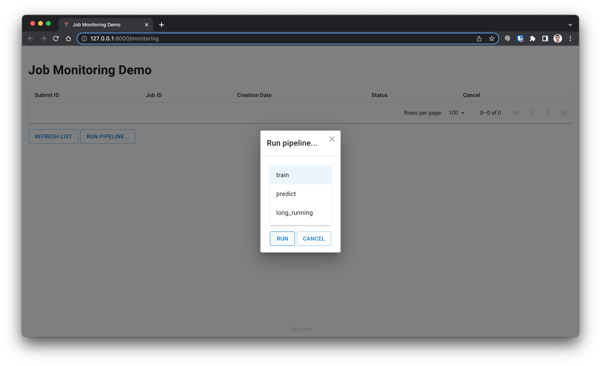
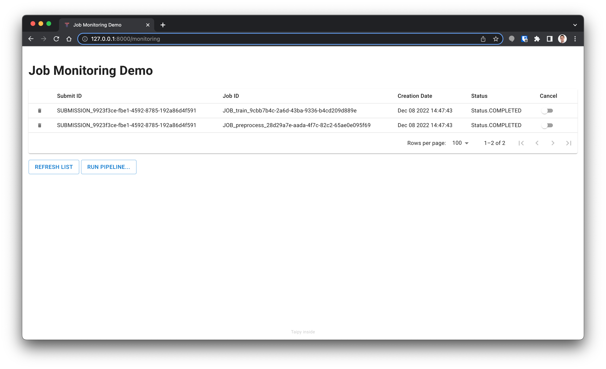
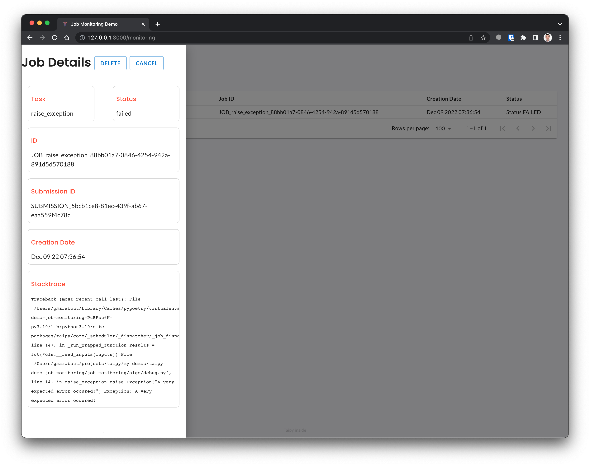

# Taipy Demo: Job Monitoring
This demo shows how to do Taipy Job Monitoring from Taipy!
Run jobs and see their progress using a simple Taipy table.

More information on Taipy [here](https://www.taipy.io).

## Installation

Use `poetry` to install the depencencies (https://python-poetry.org/docs/#installing-with-the-official-installer).

```sh
poetry install
poetry run python job_monitoring/main.py
```

## Demo Type

**Level**: Advanced
**Topic**: Taipy-Core, Taipy-GUI 

**Components**: TOML-based configuration, Job execution API

# Demo Walkthough

When run, the demo shows a single page with a table displaying all the jobs run so far.
If you started the application for the first time, no jobs would appear in the list:

<p align="center">
  
</p>


You can click on the "Run Pipeline..." button to run a pipeline:
<p align="center">
  
</p>

Select the `train` pipeline for example (the demo comes with a very simple LogisticRegression example), and press "run":
<p align="center">
  
</p>

The table now shows two jobs: 
* a "preprocess" task (it's JOB ID is `JOB_preprocess_28d29a7e-aada-4f7c-82c2-65ae0e095f69` here-above, but may be different for you) 
* a "train" task (it's JOB ID is `JOB_train_9cbb7b4c-2a6d-43ba-9336-b4cd209d889e` but can be different for you)

Those two jobs are fast and are already in status "COMPLETED".

You can open the details of the job by clicking on a row. This opens a side panel with details:
<p align="center">
  
</p>

If a job has failed because of a code exception, then the side panel will display the related stack trace.


You can run two other pipelines: the "predict" pipeline which would use the output of the "train" pipeline to run a simple Logistic Regression model using Scikit-Learn, or a "long_running" pipeline which does nothing else than simulating a 20 seconds jobs.
After 20 seconds, the job will automatically appears as "COMPLETED" in the user interface.

# Directory Structure
 - `data/` contains a simple dataset for the logistic regresion example (which is out of scope of this demo).
 - `job_monitoring/` contains the main source code. This is where you can find the main `main.py` file to run the app.
    - `job_monitoring/algo` contains the code to be execute in Taipy pipelines: the file `ml.py` contains a simple logistic regression problem, and `debug.py` a simple code to make a long running task.
    - `job_monitoring/pages` contains the code for the pages of the app. The main page is `monitoring.py`. This code has been in such a way that you can just copy/paste it into your own app to get the job monitoring table. 
 - `app.config.toml` contains the configuration for this Taipy app. It basically defines the data nodes, tasks and pipelines configuration.  
 - `CONTRIBUTING.md` instructions to contribute to this demo
 - `LICENSE` the Apache 2.0 license.
 - `pyproject.toml` the poetry configuration file
 - `README.md` this file